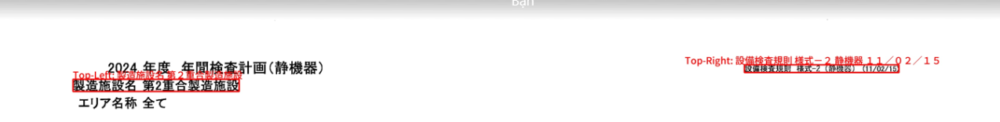
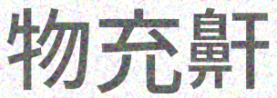

# TODO
1. Trainning scripts
3. Scrip for text generation

# Test 

# Some sample synthetic data

# Key requirements
transformers >= 4.5x 
python 3.11 is recommended which is my case (i also test run well with python 3.9)
# Download weight 
```bash
wget https://github.com/phu2007vis/Japanese_OCR/releases/download/weights/weights_main.zip
unzip weights_main
```
```
Ensure the stucture of weight is:
--root
    --weights_main
        --phuoc
            --all file weights and config here
```
Eou can also customize load weight process at manga_ocr_dev/training/get_model.py

